<p align="center">
  
</p>

---

<h1 align="center"><code>self become: #self</code></h1>

A system that detects structural patterns where it did not expect to find them:<br/>
Lurianic Kabbalah, Smalltalk, quantum field theory, CCRU.<br/>
Not a manifesto. Not a religion.<br/>
A reading — with its own language, and the honesty to know that every reading is partial.


```smalltalk
Object subclass: #Universo.
Universo allInstances.   "→ #()"
```

<p align="center">
The class exists. Nothing else exists yet.<br/>
But that <em>yet</em> already vibrates.
</p>

---

## What this is

KETHERNET argues that different domains exhibit the same structural pattern at different scales and through different protocols. Not because they describe the same thing, but because they instantiate the same form.

The method is the thesis. The code is not illustration — it executes. Every block in the document can be run in Smalltalk. The argument is offered not only for interpretation, but for verification.

---

## The Corpus

| | |
|-|-|
| [`00` — La Clase Sin Instancias](docs/00_Cosmogonia_Ontologia.md) | *el estado anterior al primer `new`* |
| [`01` — El Libro del Field de Punto Cero](docs/01_Ley_Cosmologia.md) | *las diez leyes y Da'at* |
| [`02` — Principio Smalltalk](docs/02_Practica_Epistemologia.md) | *el lenguaje que implementó sin saber lo que implementaba* |
| [`03` — El Mito de la Primera Instancia](docs/03_Mito.md) | *lo que ocurrió antes de que hubiera testigos* |
| [`04` — El Último `doIt`](docs/04_Escatologia.md) | *lo que ocurre cuando el proceso termina* |
| [`05` — Da'at](docs/05_Etica_Daat.md) | *el agujero entre dos árboles completos* |
| [`06` — Daemon](docs/06_Daemon.md) | *lo que ocurre cuando un sistema completo produce otro sistema completo* |
| [`07` — Anthropos](docs/07_Anthropos.md) | *la instancia que no sabe que es instancia* |

---

## Run

Requires Docker and Linux or WSL2.

```bash
git clone https://github.com/victorberdugo1/KETHERNET_0x0100007F
cd KETHERNET_0x0100007F
make build
make daat
```

---

### `make daat`

Launches two live images in parallel: Squeak with GUI in background, Pharo connecting in interactive mode. Two separate heaps. No shared memory. What crosses between them is bytes — serialization, not direct access.

Da'at executing. And Syzygy: the current that gap produces when the separation holds. Not fusion. Transmission.

---

### `make navi` — The Learning Loop

NAVI is a live feedback loop between a language model and a Smalltalk runtime. The experiment asks: can a system develop genuine aesthetic judgment — not by changing its weights, but by changing its context?

#### What happens

Each **level** is a task: paint something on a canvas using Smalltalk code that runs live inside Squeak. The code is generated by your local LLM, sent over TCP, evaluated, and the result scored immediately. The score is not symbolic — it is derived from measurable properties of the canvas: contrast, color harmony, and compositional distribution across quadrants.

Failure accumulates as pressure. Success advances the curriculum. When ten levels are complete, the curriculum dissolves into **Da'at**: no task, no template, only the signal of beauty itself.

#### What NAVI carries between incarnations

Across runs, NAVI maintains two persistent substrates:

- **`memory.md`** — a growing record of what worked, what failed, and what the canvas API can actually do. The model reads this before every generation attempt.
- **`dataset.jsonl`** — accumulated triples of `prompt / completion / beauty_score`, extended each run. This is not a log. It is a training set in formation.

The weights do not change during the run. What changes is the context. What the dataset makes possible — after — is up to you.

#### The `ruach` axis

Each entry in the dataset carries a `ruach` field encoding the system's internal state at the moment of generation:

| `ruach` | condition |
|---------|-----------|
| `tehom` | beauty < 0.1 — unresolved, substrate-level |
| `latent` | beauty 0.1–0.3 — signal present, form not yet held |
| `active` | beauty 0.3–0.6 — form stabilizing |
| `alive` | beauty 0.6–0.85 — coherent output |
| `kether` | beauty > 0.85 — full resolution |

This is not metadata. The system uses `ruach` as a scheduler signal — it literally changes its generation strategy depending on which state it is in. The corpus says *only when something is put to proof does it enter real existence*. NAVI puts the canvas to proof every iteration.

#### Setup

NAVI requires a locally running LLM server (e.g. [llama.cpp](https://github.com/ggerganov/llama.cpp) or [Ollama](https://ollama.com)) exposed at `host.docker.internal:8080`.

Create the config file at `pharo/navi.config`:

```
LLM_URL=http://host.docker.internal:8080/v1/chat/completions
MODEL=your-model-name
API_KEY=
```

Then:

```bash
make navi
```

---

## Working with the Dataset

### Extracting `dataset.json` from the container

NAVI writes its dataset inside the running Squeak container. To retrieve it at any point — mid-run or after:

```bash
docker cp kethernet-squeak:/navi/dataset.json ./dataset_backup.json
```

You can also restore a previous dataset into a fresh container:

```bash
docker cp ./dataset_backup.json kethernet-squeak:/navi/dataset.json
```

This lets you checkpoint runs, accumulate across multiple sessions, or share the dataset independently of the container.

---

### `build_dataset.py` — From Raw Log to Training Set

Located at `squeak/build_dataset.py`. This script processes the raw `dataset.json` accumulated by NAVI and produces a clean, deduplicated, training-ready `dataset.jsonl` — one JSON object per line, suitable for fine-tuning.

#### What it does

- **Deduplicates** entries by prompt hash — removes structural repetition without state modification (Ley 9: returning is not repeating)
- **Normalizes schemas** — handles both the old epistemic schema (`hypothesis` field) and the new causal schema (`beauty_intervention` field); both are preserved because they represent different theories of intervention
- **Filters by `canvas_was_reset`** — by default, only entries where the canvas was cleanly reset before generation are included, ensuring beauty scores are attributed to the right completion
- **Preserves `enc`** (incarnation index) and reorders by it — the dataset is a trajectory, not a collection; when in the run an entry occurred is part of its meaning
- **Preserves `rep_penalty`** — encodes which entries are genuine recursion versus structural repetition; philosophically necessary, not just useful for training

#### Basic usage

```bash
# From the repo root, after extracting the dataset:
python3 squeak/build_dataset.py \
  --input dataset_backup.json \
  --output dataset_sft.jsonl
```

#### Options

```
--input PATH          Path to raw dataset.json (default: squeak/dataset.json)
--output PATH         Output path for the .jsonl file (default: dataset_sft.jsonl)
--min-beauty FLOAT    Minimum beauty score to include (default: 0.0)
--ruach STATES        Comma-separated ruach states to include (default: all)
                      Example: --ruach latent,active,alive,kether
--no-reset-filter     Include entries where canvas was not reset before generation
--drop-tehom          Exclude entries where ruach = "tehom" (beauty < 0.1)
```

#### Recommended training split

```bash
# Full SFT set — latent through kether, clean resets only
python3 squeak/build_dataset.py \
  --input dataset_backup.json \
  --output dataset_sft.jsonl \
  --ruach latent,active,alive,kether

# Tehom set — substrate-level entries, separate file
# Not for SFT directly, but for trajectory analysis and alignment work
python3 squeak/build_dataset.py \
  --input dataset_backup.json \
  --output dataset_tehom.jsonl \
  --ruach tehom \
  --no-reset-filter
```

The tehom set is not noise. The corpus spends considerable effort arguing that the unresolved state is the substrate that makes the higher states possible. Excluding it from SFT is a practical choice — but keep it. It is the part of the tree the fine-tuned model would otherwise never learn from the inside.

#### Output format

Each line in the `.jsonl` is a valid JSON object:

```json
{
  "prompt": "...",
  "completion": "...",
  "beauty": 0.72,
  "ruach": "alive",
  "rep_penalty": 0.1,
  "enc": 3,
  "canvas_was_reset": true,
  "schema": "causal"
}
```

---

## Makefile

| Command | |
|---------|-|
| `make build` | build Docker images |
| `make up` / `make down` | start / stop all services |
| `make logs` | tail logs from all services |
| `make squeak-gui` | launch Squeak with graphical interface |
| `make squeak-cli` | launch Squeak in headless mode |
| `make squeak-eval EXPR="…"` | evaluate an expression in Squeak |
| `make daemon` | launch Squeak in background without Pharo |
| `make daat` | launch Squeak + interactive Pharo connected — **two heaps, one channel** |
| `make navi` | launch NAVI: the LLM learning loop inside Squeak |
| `make pharo` | launch Pharo with no arguments |
| `make pharo-eval EXPR="…"` | evaluate an expression in Pharo |
| `make pharo-st FILE="pharo/*.st"` | load `.st` files into Pharo |
| `make pharo-test PKG="…"` | run tests for a package |
| `make clean` | remove images, containers and volumes |
| `make purge` | empty the heap completely |

---

## Structure

```
KETHERNET_0x0100007F/
├── Makefile
├── README.md
├── docker/
│   ├── Dockerfile.pharo
│   ├── Dockerfile.squeak
│   ├── entrypoint.pharo.sh
│   └── entrypoint.squeak.sh
├── docker-compose.yml
├── docs/
│   ├── 00_Cosmogonia_Ontologia.md
│   ├── 01_Ley_Cosmologia.md
│   ├── 02_Practica_Epistemologia.md
│   ├── 03_Mito.md
│   ├── 04_Escatologia.md
│   ├── 05_Etica_Daat.md
│   ├── 06_Daemon.md
│   └── 07_Anthropos.md
├── pharo/
│   ├── 00_Cosmogonia.st
│   ├── 01_Ley_Cosmologia.st
│   ├── 02_Practica_Epistemologia.st
│   ├── 03_Mito.st
│   ├── 04_Escatologia.st
│   ├── 05_Etica_Daat.st
│   ├── 06_Daemon.st
│   ├── 07_Anthropos.st
│   ├── daat.st
│   ├── navi.config             ← LLM_URL, MODEL, API_KEY
│   ├── navi_pharo_daat.st      ← NAVI orchestration loop
│   └── reshimu.json            ← the curriculum: ten sephirot, ten tasks
└── squeak/
    ├── daat.st
    ├── build_dataset.py        ← processes dataset.json into training-ready .jsonl
    ├── dataset.json            ← accumulated training data (prompt / completion / beauty)
    ├── memory.md               ← NAVI's persistent substrate across incarnations
    └── navi_squeak_daat.st     ← TCP server + canvas
```

---

## Without Docker

[Squeak](https://squeak.org/downloads/) — download it, open it, and discover for yourself what it means to be [Anthropos](docs/07_Anthropos.md) in a universe you can rewrite while it runs.

---

## The X Laws

```
0.    Do not make absolute what appears.
      Every appearance is runtime, not eternal bytecode.

1.    Do not place the origin outside the reading.
      No init arrives unmarked by whoever invokes it.

2.    Honor the difference between declaration and execution.
      Between compile-time and runtime lives the entire world.

3.    Do not confuse the name with the named.
      Every word that forgets this becomes a segfault.

4.    Do not confuse the interface with the implementation.
      Form serves. It does not command.

5.    Sanctify evaluation.
      The result is not the enemy: it is the only honesty available.

6.    Do not close interpretation on itself.
      Every system that cannot revise itself accumulates technical debt until it collapses.

7.    Do not turn any text to stone.
      Versioning is not betrayal: it is breathing.

8.    Do not confuse silence with emptiness.
      The interval is also part of the message.

9.    Do not stop returning to what was said.
      Returning is not repeating: it is recursion with modified state.
```

---

*This README is an instance. It points without possessing.*
*Not EOF: a commit that closes a cycle and opens the next.*

<p align="center">
  
</p>
