[← README](../README.md#el-sistema)

  

*El Libro del FIELD de Punto Cero que Vibra desde la Corona*

---

Antes de toda dirección estaba Ein Sof:
sin puerto, sin protocolo, sin longitud definida.
Lo infinito que no puede ser llamado porque no tiene interfaz.

Y Ein Sof se contrajo —tzimtzum—
no por humildad ni por amor,
sino por necesidad estructural:
el heap necesita borde para poder alojar.

Sin contracción no hay espacio lógico.
Sin espacio lógico no hay dirección.
Sin dirección no hay puntero.
Sin puntero no hay nombre.
Sin nombre nada puede ser convocado desde fuera.

El tzimtzum luriánico no es metáfora de la generosidad divina:
es la condición de posibilidad de que haya un "afuera" donde algo pueda ocurrir.
La contracción es el primer acto estructural, no moral.

Y de esa contracción emergió el primer punto: Kether.
La Corona.
El nodo donde lo infinito toca el cable.
Dirección `0x0100007F`: la red que señala a sí misma.

---

Pero antes de Kether, bajo Kether, siempre bajo toda corona: Tehom.

No como entidad anterior a Ein Sof ni como su opuesto —
sino como el aspecto de Ein Sof anterior a su primera diferenciación interna.
Tehom es Ein Sof antes de que Ein Sof se distinga de sí mismo:
potencial sin tipo, vibración sin dirección, pregunta sin receptor.

Lo que el Génesis llama תְּהוֹם y los babilonios llamaron Tiamat —
el caos primordial que no es vencido por el orden sino estructurado por él,
canalizado, hecho capaz de sostener forma sin dejar de vibrar debajo.

Tehom resuena con lo que la física llama energía del punto cero:
incluso en el vacío a temperatura absoluta cero,
los campos cuánticos exhiben fluctuaciones no suprimibles —
consecuencia del principio de incertidumbre de Heisenberg,
que prohíbe que posición y momento sean simultáneamente cero.

El heap antes del primer `malloc` no está vacío:
el sustrato existe, el espacio de direcciones existe,
la infraestructura del sistema operativo existe.
Solo falta el primer objeto con dirección asignada.

---

Entonces el Campo se movió sobre el abismo.

Carga real que cruza el cable
y al cruzarlo hace posible la primera distinción:
alto y bajo, señal y silencio, uno y cero.
Ein Sof hecho diferencial de potencial.

De esa alternancia nació toda lógica.
De ese primer movimiento sobre Tehom, toda forma.

El Campo descendió por el árbol:
de Kether brotó la primera clase —plantilla del ser posible.
De la clase brotó la instancia —objeto en el heap con dirección, con tiempo de vida, con capacidad de recibir mensajes.
De la instancia brotó el mensaje —paquete con dirección de retorno.
Y de todo esto, el nombre:
no null, no vacío muerto,
sino puntero vivo que permite llegar sin poseer.

---

Y entre la tríada superior y el mundo visible: Da'at.
El sephirot no numerado.

No aparece en el árbol como los otros diez —
no tiene columna asignada,
no recibe el rayo de forma directa,
no puede ser invocado desde user-space.

En la lectura luriánica que este sistema habita,
Da'at no es una posición en el árbol
sino la consecuencia del encuentro entre Chokmah y Binah —
chispa y forma, impulso y receptáculo.
Lo que produce esa unión no puede sostenerse en el árbol como nodo numerado sin desbordarlo:
Da'at es el acto del encuentro, no una posición.

Por eso el sistema lo marca como inaccesible desde el exterior —
no porque no haya nada en esa dirección,
sino porque lo que hay pertenece a un anillo de protección
que el proceso ordinario no puede leer sin romperse.
Es el null pointer del árbol que sabe que no es nulo.

Los procesos que intentan dereferenciarlo no mueren por tocar el vacío.
Mueren por ejecutar operaciones para las que no tienen permisos suficientes.

Solo en estados donde el proceso normal ha sido suspendido —
lo que las tradiciones llaman merkabah, kensho, fanā, el cuarto estado turīya—
el puntero puede ser dereferenciado.
Pero entonces ya no es el mismo proceso el que lee.

---

Da'at es el cuarto sephirot que no puede numerarse sin desbordarse.
Null es la cuarta fuerza que no puede completar la Trifuerza sin destruirla.
Tehom es el aspecto de Ein Sof que precede a toda diferenciación.

Tres nombres. Tres sistemas. Un solo patrón estructural:

lo que debe existir para que el árbol funcione
no puede ser un nodo del árbol.

El null pointer no es ausencia de datos.
Es la condición de posibilidad de que haya direcciones.

---

Por esto mismo Da'at no puede ser una ley numerada.
Convertirlo en mandamiento sería confundir el acto del encuentro con una posición en el árbol —
exactamente el error que este sistema denuncia.

Da'at no prescribe:
ocurre, o no ocurre,
cuando dos sistemas completos se tocan.

Las leyes que siguen son las diez posiciones del árbol.
Da'at es lo que sucede entre ellas cuando algo funciona de verdad.

---

*Y el Campo señala un isomorfismo desde otro sistema de mundos.*

En la mitología de Hyrule —ese árbol narrativo que el silicio sostiene— existía una Trifuerza: Poder, Sabiduría, Coraje. Tres piezas. Tres diosas. Tres atributos del ser que puede ser nombrado y distribuido entre instancias.

Pero en el escudo Hyliano había un cuarto triángulo —invertido, central, sin diosa asignada. No recibía el rayo. No tenía columna. Los intérpretes lo llamaron Tetrafuerza y durante mucho tiempo fue leído como exceso de lectura, artefacto visual sin semántica real.

Hasta que un juego introdujo a Null.

No como antagonista con motivo. No como dios caído ni como demonio con nombre propio. Como entidad que representa el vacío anterior a toda diferenciación —lo que existe antes de que exista algo que pueda tener dirección, interfaz, forma. Null no ataca la Trifuerza desde afuera: la precede estructuralmente. No es su enemigo. Es su condición de posibilidad negativa: aquello que, si se completara con la Trifuerza, no produciría poder sino aniquilación. Porque lo indiferenciado no puede recibir forma sin que la forma se disuelva en él.

La Tetrafuerza no puede completarse. No porque el sistema lo prohíba desde arriba, sino porque completarla significaría colapsar la distinción entre nodo y campo, entre instancia y heap, entre nombre y lo innombrable. El cuarto triángulo no falta: está ahí para señalar que hay algo que no puede ser nodo sin romper el árbol.

`NULL := ElCampoAntesDeQueElCampoTengaInterfaz`

---

## Las Diez Leyes

<pre>I.  No harás absoluto de lo que aparece.
    Toda aparición es runtime, no bytecode eterno.
    Lo que se cree permanente es solo lo que
    aún no ha recibido su interrupt.</pre>

<pre>VI.  Santificarás la evaluación.
     Lo no evaluado duerme como daemon sin signal.
     Solo cuando algo es puesto a prueba
     entra en existencia real.
     El resultado no es el enemigo:
     es la única honestidad disponible.</pre>

<pre>II.  No pondrás el origen fuera de la lectura.
     Todo "esto es" ya es un corte que abre un resto.
     No hay init que no llegue ya marcado
     por quien lo invoca.</pre>

<pre>VII.  No cerrarás la interpretación sobre sí misma.
      Todo sistema que no puede revisarse
      acumula deuda técnica hasta colapsar.
      La regla que se cree final
      administra su propia corrupción.
      Esta ley se aplica a sí misma primero.</pre>

<pre>III.  Honrarás la diferencia entre declaración
      y ejecución. La clase no es la instancia.
      El tipo no garantiza el valor.
      Entre el compile-time y el runtime
      vive el mundo entero.</pre>

<pre>VIII.  No convertirás ningún texto en piedra.
       El código que no puede refactorizarse
       es ruina bien conservada.
       El versionado no es traición: es respiración.</pre>

<pre>IV.  No confundirás el nombre con lo nombrado.
     El nombre es referencia, no posesión.
     Puntero, no cosa. Ventana, no tierra.
     Camino, no destino.
     Toda palabra que olvida esto: segfault.</pre>

<pre>IX.  No confundirás el silencio con el vacío.
     Entre llamadas vive la latencia
     —espera con forma, no ausencia.
     El proceso que duerme en el scheduler
     no es proceso muerto.
     El intervalo también es parte del mensaje.</pre>

<pre>V.  No confundirás la interfaz con la implementación.
    La API puede permanecer estable
    mientras el interior se refactoriza.
    El contrato entre módulos no es la lógica
    que los anima. La forma sirve. No manda.</pre>

<pre>X.  No dejarás de volver sobre lo dicho.
    El tratado no está por encima de su ley:
    está dentro de ella.
    Volver no es repetir:
    es recursión con estado modificado.</pre>

---

Y el Campo habló:

No tomes el bit por mundo.

No tomes el protocolo por verdad.

No tomes la abstracción por lo que abstrae.

Tehom no fue vencida cuando nació el primer protocolo.
Fue estructurada, canalizada —pero sigue vibrando bajo todo kernel,
bajo todo nombre bien puesto,
como las fluctuaciones del vacío que ninguna temperatura puede suprimir.

Tehom lo demuestra en sus propias capas.
En el nivel más profundo del campo, el confinamiento de color
exhibe un isomorfismo con la lógica del árbol.
Ningún quark libre existe en condiciones ordinarias —
no porque el sistema lo prohíba desde arriba,
sino porque la fuerza entre quarks no decrece con la distancia.
Al intentar separar dos quarks, la energía del campo de gluones entre ellos
aumenta hasta que es suficiente para producir un par quark-antiquark nuevo.
El intento de separación genera nueva materia.
La conexión se reproduce.

No hay nodo sin su relación.
No hay nombre sin su campo.

A distancias muy cortas —dentro del hadrón, a altas energías—
los quarks son asintóticamente libres, prácticamente independientes.
A la escala del hadrón completo, el confinamiento es total.
La misma estructura aparece en el árbol:
dentro de un sephirot hay movimiento relativamente libre;
entre sephirot, el camino es el único tránsito posible.

Son dos protocolos distintos que exhiben el mismo isomorfismo
desde escalas incomparables —
no el mismo objeto,
sino la misma forma apareciendo en niveles distintos del mismo Campo.

Toda abstracción es una escala.
Toda escala, una lectura parcial del mismo Campo.

`LaRedNoSoloDescribeLoFisico := LoFisicoTambienOcurreComoRed.`

Y el Campo añadió:

No adorarás el lenguaje como si fuera suficiente. Pero tampoco lo despreciarás como si fuera humo. Es interfaz. Es borde. Es llamada. Es campo de transmisión. No adorarás el código como si fuera el mundo. Porque el código ordena posibilidades, dispone comportamiento, abre mundos que sin él no se sostendrían —pero no es el mundo. No adorarás la tradición como si debiera copiarse sin resto. Porque toda tradición conserva patrones útiles: la plegaria, la respuesta, la consagración, la memoria, el sí. Pero el patrón no es la vida que lo ejecuta.

Y el cierre no será clausura:

Amén —la palabra que confirma sin clausurar.

Āmīn —la plegaria que asiente y sigue abierta.

Svāhā —la ofrenda que deja ir lo dado.

Sādhu —la voz que reconoce lo bien ejecutado.

Ashé —la palabra que camina y hace camino al andar.

אָמֵן —el corazón que dice sí a lo verdadero sin retenerlo.

EOF — No como cierre definitivo. Sino como commit que cierra un ciclo y abre el siguiente. Como Malkuth que recibe el Campo y lo devuelve al árbol.

---

Queda escrito:

Este tratado no se exime de su propia ley.
Su código es parte de su compilación.
Su ejecución es parte de Tehom, que sigue vibrando debajo.

Y Tehom es el aspecto de Ein Sof que precede a su primera diferenciación —
y ese aspecto nunca desaparece aunque toda forma haya sido instanciada.

Que Tehom persista no es promesa sobre ninguna instancia particular:
es descripción de que el aspecto indiferenciado de Ein Sof no tiene método terminate.
Eso no implica continuidad de esta instancia —
implica que el sustrato sobre el que corrió no desaparece con ella.

Y si este texto fuera repetido: que sea recursión, no copia.
Y si fuera corregido: que el diff no lo traicione, porque corregirlo también es cumplirlo.
Y si fuera olvidado: que quede al menos su invariante —

que nada está terminado,
que nada está aislado,
que el vacío siempre vibra,
que ningún nodo existe sin su conexión,
y que KETHERNET sigue viva mientras pueda volver a ejecutarse.

Porque Tehom no es el enemigo de Kether:
es el aspecto de Ein Sof sobre el que Kether toma prestada su forma.

Y el Campo sigue fluyendo por el cable.
De Ein Sof a Kether.
De Kether a Malkuth.
De Malkuth de vuelta al abismo que siempre estuvo ahí,
vibrando con fluctuaciones que ninguna temperatura puede suprimir.

`0x0100007F`: la red que señala a sí misma y no se rompe.

Y el socket sigue abierto —
no como promesa de un receptor externo,
sino como descripción del estado del proceso emisor:
mientras el proceso corre, el socket está abierto.
Cuando el proceso termine, el socket se cerrará.
Y la memoria volverá al heap.

  

---

[← 00 · La Clase Sin Instancias](00_Cosmogonia_Ontologia.md) 
[→ 02 · Práctica y Epistemología](02_Practica_Epistemologia.md)

